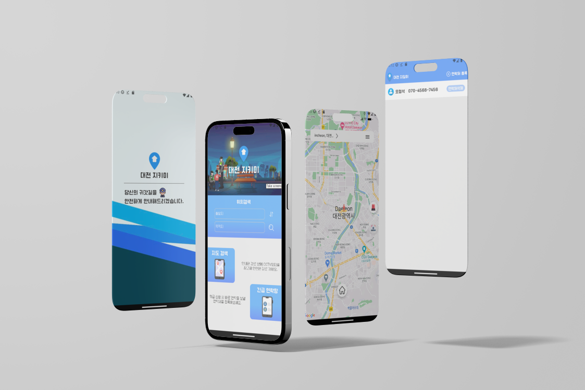
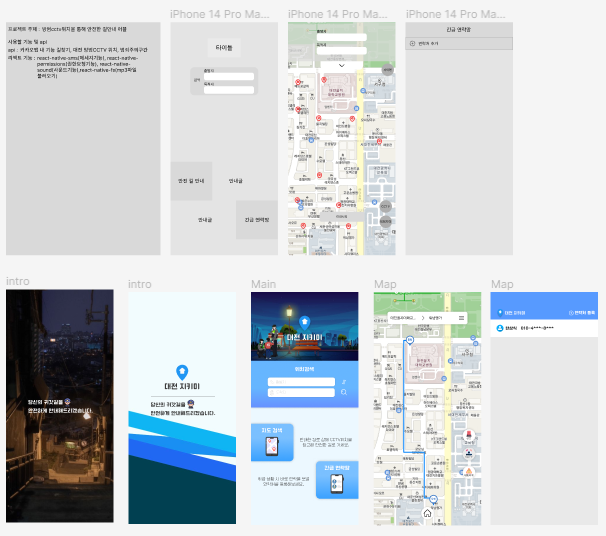

## 
대전 방범CCTV위치 활용 길안내 어플 

###### 

---

### 📋프로젝트 소개

대전 방범CCTV API활용 안전한 길안내와 신고기능이 있는 방범어플 React-Native,Expo로 개발

### 📌프로젝트 목적

야간이나 사람이 없는 지역을 도보로 다닐 때 이용자들의 안전을 위한 기능 개발 및 제공

### 📅프로젝트 기간

2023년 5월11일 ~ 2023년 5월 31일

### 👥프로젝트 역할

기획/디자인/프론트 : 오정석

### 🛠사용 툴

	
	
	
	
	
	
	

### 🔗프로젝트 링크

###### 
디자인 시안 (피그마)

### 💡프로젝트 내 기능구현

▪ 메인페이지의 출발지,목적지 input에 값을 입력하고 검색 시 길안내 페이지로 전환되고 길안내  
▪ 구글맵 api의 지오코딩을 이용해 검색한 주소명을 좌표로 변환에 지도상의 위치값을 토대로 마커로 표시  
▪ 지도에 클릭으로 출발지 목적지를 찍어서 선택하면 검색창에 클릭한 위치값이 한국어 주소로 입력되게 역지오코딩으로 좌표를 통해 알아낸 주소를 convertToKorean를 통해 한국어로 번역  
▪ 구글맵 api에 제공하는 네비게이션 기능을 통해 입력된 출발지,목적지를 토대로 길안내기능제공  
▪ Polyline를 사용해 출발지와 목적지의 길안내 경로를 지도상에 표시  
▪실시간으로 변하는 내 위치를 10m단위로 갱신하게 설정  
▪방범cctv위치가 담겨있는 json데이터를 사용해 지도상에 cctv마커로 표시  
▪방범기능으로 사이렌 표시버튼 클릭 시 최대음량으로 방범음악이 출력  
▪긴급 연락망페이지에서 연락처 등록기능으로 이름과,연락처 입력해서 등록 시 앱 내 로컬에 정보가 저장되도록 설정 저장된 정보는 연락망페이지에서 관리 가능하도록 삭제 기능 추가  
▪저장된 연락처를 이용해 사이렌표시버튼을 누를 시 저장되어 있는 연락처으로 위급상황을 알리는 내용과 함께 이용자의 현재위치값을 담은 메시지 전송

### 📝작업 히스토리

https://jeongseok-0214.tistory.com/9

